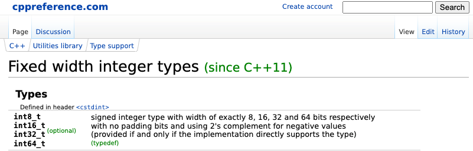

<!-- .element: data-background-image="img/title.png" -->

NOTES:

* I'm going to be talking today about a project I worked on for about a
  year-and-a-half. Several other engineers had worked on it for many years
  before me.
* This is a particularly fun one for me to talk about, because I
  actually uttered this phrase, or something similar, when I started on this
  project.
* So we're going to be exploring a few of the things that make this a hard
  problem. And some of the things you might not expect to make this difficult.
* And with that, lets dive right into it. Since we're talking about integers, 
  it's worth reviewing some of the details of what integers are in C++.

@@@@@

## Standard integer types

|              |||                         |
|--------------|||-------------------------|
|`signed char` ||| `unsigned signed char`  |
|`short`       ||| `unsigned short`        |
|`int`         ||| `unsigned int`          |
|`long`        ||| `unsigned long`         |
|`long long`   ||| `unsigned long long`    |

NOTES:

* These ten types are what C++ calls the "standard integer types."
* There's `signed char`, `short`, `int`, `long`, and `long long`, and then the unsigned versions of each of them.
* All of our problems start here. The standard guarantees surprisingly little about these types.
* The most important property for our discussion today is that of "bit width"

@@@

## Bit Width

| Width          || `signed`          || `unsigned`                |
|---------------:||:-----------------:||:--------------------------|
| 4              || -8 ... 7          || 0 ... 15                  |
| 8              || -128 ... 127      || 0 ... 255                 |
| 16             || -32768 ... 32767  || 0 ... 65535               |
| &vellip;&nbsp; || &vellip;          || <center>&vellip;</center> |
| N              || &nbsp;&nbsp;&nbsp;&nbsp;&nbsp;&nbsp;-2<sup>(N-1)</sup> ... 2<sup>(N - 1)</sup> - 1 || 0 ... 2<sup>N</sup> - 1   |

NOTES:

* "Bit width" tells us which integer values can be represented by a type.
* There are infinitely many integers, but computers are finite, so we deal with 
  this by only allowing some values to be stored in an integer.
* I've shown some examples of bit widths here and what they mean.
* A bit width of `N` means you can represent up to 2<sup>N</sup> possible values.
  And for the standard integer types, it specifically means these values. The 
  unsigned integers represent the values from 0 up to (but not including) 2<sup>N</sup>.
* The signed values represent a range of the same size that's almost centered at
  zero. They can actually represent one more negative value than they can 
  positive values, and that's because zero takes up one of the spots we would 
  otherwise allot to a positive integer.
* When I first started learning C++, I was told "an `int` is 4 bytes. It can hold 
  values between -2<sup>31</sup> and 2<sup>31</sup> - 1."
* But that's not the whole story. That was probably true on whatever computer I 
  was using at the time, but it's by no means guaranteed.

@@@

| Type          || Bit width requirements |
|---------------||------------------------|
| `signed char` || `>= 8`                 |
| `short`       || `>= 16`                |
| `int`         || `>= 16`                |
| `long`        || `>= 32`                |
| `long long`   || `>= 64`                |

NOTES:

* Here's what the standard has to say about bit widths.
* An int needs to have a bit width of at least 16. It's often 32, but 20 would 
  be a perfectly reasonable bit width.
* So what do we do now? If I want to represent a number, what type should I use?
* How do I know the type I choose will be large enough? I might not know the 
  platforms I'm working on.
* The answer is, you do something like this...  

@@@

```cc[]
#if defined(__linux__)
# if defined(__x86_64__) 
typedef long int64;
# else
typedef long long int64;
# endif
#elif defined(__ANDROID__)
// ...
#endif
```

NOTES:

* You use the preprocessor to ask which platforms you're compiling for, and you 
  define an alias to be some type that your platform documents to be the right 
  size.
* Now, today, we're going to focus on just one platform, and it's a common one. 
  We're going to talk about X86 architectures, running linux and being compiled 
  with Clang or GCC.
* There are tons of other platforms where the same problems come up, but I want to
  keep us focussed on just one platform, because it's already hard enough without
  thinking about multiple platforms.
* So our story starts with a file just like this one.

@@@

## A long long time ago...

```cc
// integral_types.h
typedef signed char int8;
typedef short       int16;
typedef int         int32;
typedef long long   int64;
```

NOTES:

* The year is 1999. Google is a small company with 40 employees. And
  these `typedef`s are added to the codebase.
* As I mentioned there are platforms out there for which these `typedef`s are 
  incorrect. But we're ignoring those platforms today.
* I think the main takeaway I want you to have from this slide, is that there's 
  no bug here. No one made a mistake. Nothing is incorrect.
* On this platform `int` is 32 bits wide, and `long long` is 64 bits wide.

@@@

## C++11 introduces `<cstdint>`



NOTES:

* Fast-forward about a decade. The C++11 standard introduces aliases, that serve the
  same purpose.
* This is great, if we use these type aliases, our code will be more compatible
  with external projects.
* It will allow us to use open source projects more easily, and more easily open
  source our own projects. And it makes it easier for new hires who are already 
  familiar with the standard library to get up to speed.
* So, this is our goal:

@@@

## The plan

<ol>
<li style="color: rgba(0,0,0,0);">Ensure <code>int64</code> is the same type as <code>int64_t</code></li>
<li style="color: rgba(0,0,0,0);">Change use of <code>int64</code> to <code>int64_t</code></li>
<li style="color: rgba(0,0,0,0);">Replace <code>#include</code>s</li>
<li value="1">Delete <code>"integral_types.h"</code></li>
<li style="color: rgba(0,0,0,0);">Ice cream party</li>
</ol>

NOTES:

* We want to delete "integral_types.h" in favor of using the standard library.
* Once we've done that, we get all the...

@@@

## The plan

<ol>
<li style="color: rgba(0,0,0,0);">Ensure <code>int64</code> is the same type as <code>int64_t</code></li>
<li style="color: rgba(0,0,0,0);">Change use of <code>int64</code> to <code>int64_t</code></li>
<li style="color: rgba(0,0,0,0);">Replace <code>#include</code>s</li>
<li value="1">Delete <code>"integral_types.h"</code></li>
<li>Ice cream party</li>
</ol>

NOTES:

* ...amazing benefits that come from using the standard library.
* But we can't just delete "integral_types.h". Everything will break if we do 
  that. We need to first...

@@@

## The plan

<ol>
<li style="color: rgba(0,0,0,0);">Ensure <code>int64</code> is the same type as <code>int64_t</code></li>
<li style="color: rgba(0,0,0,0);">Replace <code>#include</code>s</li>
<li value="1">Change use of <code>int64</code> to <code>int64_t</code></li>
<li>Delete <code>"integral_types.h"</code></li>
<li>Ice cream party</li>
</ol>

NOTES:

* ...change the uses of `int64` to `int64_t` and similarly for all the other type aliases.
* we also need to...

@@@

## The plan

<ol>
<li style="color: rgba(0,0,0,0);">Ensure <code>int64</code> is the same type as <code>int64_t</code></li>
<li value="1">Change use of <code>int64</code> to <code>int64_t</code></li>
<li>Replace <code>#include</code>s</li>
<li>Delete <code>"integral_types.h"</code></li>
<li>Ice cream party</li>
</ol>

NOTES:

* ...replace  every include of "integral_types.h" with `<cstdint>`.
* Now, if you've seen talks from Hyrum Wright or Titus Winters in the past, you're
  probably aware that Google has a lot of practice making these sorts of changes.
* The idea of doing a global find/replace across our entire codebase is something
  we're not afraid of.
* It helps that we have a single monolithic repository for all of our code.
* But this is where things get tricky. We're well-practiced with find/replace 
  when the change we're making has no semantic effect on the code. If we're 
  renaming a function, or a class, for example. Drop-in replacements are easy.
* So our actual first step towards having our ice cream party is to...

@@@

## The plan

<ol>
<li>Ensure <code>int64</code> is the same type as <code>int64_t</code></li>
<li>Change use of <code>int64</code> to <code>int64_t</code></li>
<li>Replace <code>#include</code>s</li>
<li>Delete <code>"integral_types.h"</code></li>
<li>Ice cream party</li>
</ol>

NOTES:

* ...ensure that `int64` and `int64_t` are the same type. That's how we'll know
  one is a drop-in replacement for the other.
* In fact, this is the...

@@@

## The plan

<ol>
<li style="color:#f00">Ensure <code>int64</code> is the same type as <code>int64_t</code></li>
<li>Change use of <code>int64</code> to <code>int64_t</code></li>
<li>Replace <code>#include</code>s</li>
<li>Delete <code>"integral_types.h"</code></li>
<li>Ice cream party</li>
</ol>

NOTES:

* ...only thing we're going to be talking about today.
* The rest of the steps here are surprisingly interesting as well, but we're
  going to focus on just this first step today.
* So lets actually take a look at the aliases. We've learned that the standard
  doesn't make any guarantees for us, but... maybe we'll get lucky?

@@@

## Alias definitions

| Alias | "integral_types.h" | `<cstdint>` |
|-------|--------------------|-------------|
| `int8(_t)` | `signed char` | `signed char` |
| `int16(_t)` | `short` | `short` |
| `int32(_t)` | `int` | `int` |
| `int64(_t)` | `long long` | `long` |

NOTES:

* As I mentioned, the particular definitions for these aliases depend on your
  hardware, operating system, compiler, and standard library. But today we're
  focussing our attention to 64-bit X86, running linux, compiling with either 
  GCC or Clang and using their provided standard libraries.
* On those platforms, these are the definitions you'll find.
* And you can see the problem! All the aliases we have match exactly, except the
  `int64` alias.
* If these aliases **were** the same, we'd have a drop-in replacement. But 
  in fact they are different, and so we have to fix that.
* This is what we're talking about today.

@@@@@

## How Hard Could It Be?

```diff
  typedef signed char int8;
  typedef short       int16;
  typedef int         int32;
- typedef long long   int64;
+ typedef long        int64;
```

NOTES:

* This one-line change. Not even one line. A four character change.
* How hard could this possibly be?
* Before we dig into all the reasons this is hard, I want to take a moment to 
  put you in the mindset I was in when I first asked that question.
* So I'm going to tell you all the reasons this should be easy.

@@@

## How Hard Could It Be?

``` cc []
long long x = long{1234};
long y = long long{1234};


```

NOTES:

* For starters, they're interconvertible, even implicitly.
* And they represent the same range of values, so there's no possibility of 
  narrowing or data loss.

@@@

## How Hard Could It Be?

``` cc []
long long x = long{1234};
long y = long long{1234};
static_assert(sizeof(long) == sizeof(long long));


```

NOTES:

* They're exactly the same size (8 bytes).

@@@

## How Hard Could It Be?

``` cc []
long long x = long{1234};
long y = long long{1234};
static_assert(sizeof(long) == sizeof(long long));
static_assert(alignof(long) == alignof(long long));


```

NOTES:

* They have exactly the same alignment requirements (8 bytes).

@@@

## How Hard Could It Be?

``` cc []
long long x = long{1234};
long y = long long{1234};
static_assert(sizeof(long) == sizeof(long long));
static_assert(alignof(long) == alignof(long long));
assert(std::memcmp(&x, &y, 8) == 0);
```

NOTES:

* In fact the bit representations of these two types are identical.
* These types are as identical as they could possibly be. Processors don't even
  distinguish between them.
* So now that I've tricked you into thinking this is an easy problem and a very 
  short talk, I want to share with you what made this such a hard problem.
* But I don't just want to be a downer. I want to try to understand what makes 
  it difficult, and how we can reduce the cost for similar problems in the future.
* As we look examples of problems we encountered, I want you to have three 
  questions in mind. And we're going to continue to revisit these questions as 
  we go through the examples.

@@@@@

# &#x1F600;

NOTES:

* First, what went well? Where is it clear that our choices had positive impacts
  on the outcome?

@@@

# &#x1F629;

NOTES:

* Second, what went poorly? What did we miss, in terms of technical changes,
  policy, or procedure that could have produced a better outcome? These are the
  things we want to focus on fixing for next time.

@@@

# &#x1F605;

NOTES:

* Lastly, where did we get lucky? This is really speculative, but it's an
  attempt to guess about the things that might go poorly next time if the
  circumstances are mostly similar.

@@@


NOTES:

* If you've read the SRE book You may recognize these as three of the questions
  we typically ask when conducting a post-mortem.
* I think this is a really great way to frame learning from any experience, good
  or bad.
* Before we get started, I want to address a question that comes up pretty 
  frequently.

@@@

## The plan

<ol>
<li>Ensure <code>int64</code> is the same type as <code>int64_t</code></li>
<li>Change use of <code>int64</code> to <code>int64_t</code></li>
<li>Replace <code>#include</code>s</li>
<li>Delete <code>"integral_types.h"</code></li>
<li>Ice cream party</li>
</ol>

NOTES:

* The question is "why ensure that the aliases are the same first? Why not just
  start changing uses of `int64`.
* This is a fantastic question, and it has a really subtle answer.
* With either approach, the end state is the same: We'll be using `int64_t` 
  everywhere, it will be an alias for `long`, and we're going to get our ice
  cream.
* But suppose we just start changing uses of `int64` to `int64_t`. In a large
  codebase, this could take a very long time. And we're not sure exactly what 
  we're going to encounter along the way.
* What happens if we get halfway through and then find out that actually it's
  going to be too difficult to fix? Or maybe our priorities change.
* Now our codebase is half-converted. Do we convert it back? Do we leave it in 
  this intermediate state? What guidance do we provide to developers on what
  they should be using?
* On the other hand, if we make the types identical first, if we decide to
  pause, the user visible changes are minimal.
* In short, by doing all the hard work of making the aliases equivalent
  upfront, we're front-loading as much of the costs and risks as possible,
  so that we find out about problems as quickly as we possibly can.
* If you ever manage a refactoring like this, this is a majorly important idea
  that I promise will save you a lot of stress.
* PAUSE 
